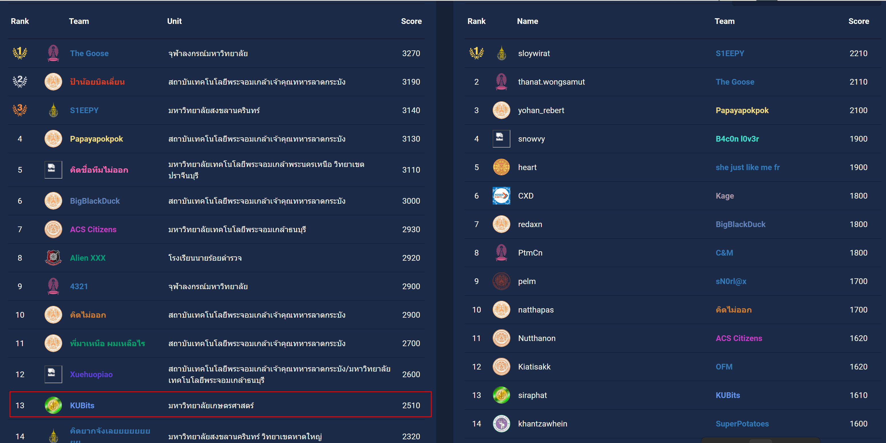

# TCTT2024-Senior-Qualifier

TCTT2024-Senior-Qualifier Writeups จากทีม KUBits

## Writepus

### Crypto (0/4)
- [Easy1](./Crypto/Easy1/)
- [Easy2](./Crypto/Easy2/)
- [Medium](./Crypto/Medium/)
- [Hard](./Crypto/Hard/)

### Forencis (0/4)
- [90Day](./Forencis/90Day/)
- [FindQR](./Forencis/FindQR/)
- [Cloudo](./Forencis/Cloudo/)
- Badcompany ( ข้อนี้ไฟล์ใหญ๋เกินไป )

### Reverse Engineer (0/2)
- [running_number](./Reverse/running_number/)
- [embedded_malware](./Reverse/embedded_malware/)

### Mobile (0/4)
- [YouSeeMe](./Mobile/YouSeeMe/)
- [Mobile](./Mobile/Mobile/)
- [TheFace](./Mobile/TheFace/)
- [ClickClick](./Mobile/ClickClick/)

### Network (0/4)
  จำชื่อโจทย์ไม่ได้ :{
- [netsec1](./Network/netsec1/)
- [netsec2](./Network/netsec2/)
- [netsec3](./Network/netsec3/)
- [netsec4](./Network/netsec4/)